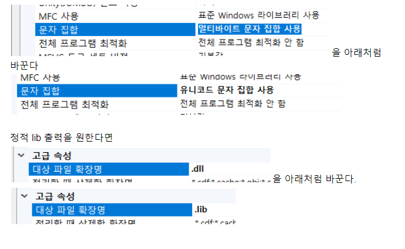

# examples_cpp_redis
C++ Redis 사용 방법 정리
    
## 공식 redis C++ 클라이언트 라이브러리 정리
- redis 공식 사이트에 가면 각 언어 별 라이브러리가 있다.
    - C++ http://redis.io/clients#c–

## hiredis 빌드하기
- 저장소: https://github.com/redis/hiredis 
- redis 공식 라이브러리
- C언어
- Windows도 지원한다.
  
### Windows
- CMake GUI 툴을 사용하여 VS 솔루션을 만든다.
- 솔루션을 열어서 빌드한다.
- defule 빌드는 동적 dll을 출력한다.
- 정적 lib을 만들고 싶다면 변경해야 한다.
    
    
    

## 크로스 플랫폼 지원
### RedisCpp-hiredis
- RedisCpp-hiredis 디렉토리
- Linux, Windows 지원
- hiredis 필요
  

### redis_client
- redis_client 디렉토리
- 한 쌍의 .h/.cpp 로 구성.
- Linux, Windows 지원
- hiredis에 의존한다. 즉 꼭 필요하다.
- pipeline 지원.
- cluster까지 지원.
- connection pool 지원.
- Thread sage.
- Reconnect automatically
- 지원하지 않는 기능
    - Support pub/sub and transaction.
    - Support scan in an unsafe way.
       
  
### r3c
- r3c 디렉토리에 Windows 지원으로 포팅했음.
    - 이후 원본에서 변경이 있는 경우 직접 업데이트 해야 한다.
- 원본 https://github.com/eyjian/r3c
- C++11 지원 필요
- Redis 5.0 기능까지 지원
- Linux, Windows 지원
- hiredis 필요.
- .h/.cpp 두 개의 파일로 구성.
- 문서가 중국어로 되어 있음.
    

### cpp_redis
- https://github.com/cpp-redis/cpp_redis
- C++11 필요.
- Linux, Windows 지원.
- pipeline, pub/sub 지원.
- (2016.10)현재 VS로는 DLL 만드는 솔루션만 제공(이것도 CMake 사용)
- static lib으로 사용하고 싶다면 따로 솔루션 파일을 만들어야 한다.
  
  
## xRedis
- https://github.com/0xsky/xredis
- Linux, Windows 지원.
- 바로는 사용 못하고 좀 작업을 해야함.
- hiredis 필요.
- support redis cluster
- support Redis master slave connection, Support read/write separation
- connection pool
- multi thread safety
- 주요 문서가 중국어
  

## Boost.Asio가 필요한 redis 라이브러리
### redisclient
- https://github.com/nekipelov/redisclient
- Boost.asio(header only) based Redis-client library.
- C++11 필요.
- Linux, Windows 지원.
  

### redisclient
- https://github.com/nekipelov/redisclient
- Linux, Windows 지원
   
   
### redis3m
- https://github.com/luca3m/redis3m
- Linux, Windows 지원.
- hiredis and boost libraries 필요.
  
  

## POCO 라이브러리가 필요한 redis 라이브러리
### poco 공식 redis
- https://github.com/pocoproject/poco
- poco 라이브러리 공식 redis 라이브러리.
- Linux, Windows 지원.
  
  
### redis-client
- https://github.com/RedisCppTeam/redis-client
- Linux, Windows 지원

  
